# RouteShare — Software Engineering Project Report

## 1. Title Page and Metadata
**Project Name:** RouteShare  
**Team Details:** 
- Mohammad Haroon (560824) – Lead Developer & Architect (haroon@example.com)  
- Maaz Ahmed (560825) – Frontend Engineer (maaz@example.com)
- Rizwan Ali (560826) – QA & Testing Engineer (rizwan@example.com)
**Course:** Software Engineering — 3rd Year  
**Timeline:** Submitted June 2026  
**Version:** v1.0.0 Release  

---

## Table of Contents

1. [Title Page and Metadata](#1-title-page-and-metadata)
2. [Executive Summary / Abstract](#2-executive-summary--abstract)
3. [Introduction and Problem Statement](#3-introduction-and-problem-statement)
4. [Requirements Specification](#4-requirements-specification)
5. [System Design and Architecture](#5-system-design-and-architecture)
6. [Implementation Details](#6-implementation-details)
7. [Testing and Quality Assurance](#7-testing-and-quality-assurance)
8. [Deployment and DevOps](#8-deployment-and-devops)
9. [Project Management and Timeline](#9-project-management-and-timeline)
10. [Conclusion and Future Enhancements](#10-conclusion-and-future-enhancements)
11. [Appendix: Additional Interaction & Flow Diagrams](#appendix-additional-interaction--flow-diagrams)

---

## 2. Executive Summary / Abstract

### The Problem
Commuting costs and vehicular emissions continue to rise, while a significant number of passenger seats remain unused during daily travel. Many existing ride-hailing services can be cost-prohibitive for regular commuters, and public transit often lacks point-to-point flexibility.

### The Solution
RouteShare is a modular commuter carpooling platform. It connects drivers who are already making a journey with passengers looking for a ride along a compatible route. The system dynamically matches users, calculates optimal pickup/drop-off sequences, and fairly splits the cost of the journey.

### Key Achievements
- Implemented a Depth-First Search (DFS) algorithm with constraint-based pruning to sequence multi-passenger stops within time and detour budgets.
- Developed a policy-chaining dynamic pricing engine handling rush hour, late-night, and same-zone conditions.
- Built a layered MVC architecture applying 8 software design patterns for maintainability and extensibility.

---

## 3. Introduction and Problem Statement

### Background
As urban populations grow, the need for cost-effective and environmentally conscious transportation increases. RouteShare addresses this by enabling drivers to share their existing journeys with passengers travelling along compatible routes.

### Objectives
- **Reduce Commuting Costs:** Allow drivers to offset fuel expenses and passengers to travel cheaply.
- **Environmental Impact:** Decrease the volume of single-occupancy vehicles on the road.
- **Safety & Trust:** Build user confidence through a time-decaying reputation tier system that incentivises reliable behaviour.

### Scope
- **Included:** User authentication, vehicle management, trip publishing, ride requesting, intelligent stop planning, dynamic pricing, and a simulated rating/reputation system.
- **Excluded:** Real-time GPS tracking of vehicles, in-app real-time chat, and live payment processing (Stripe is currently mocked for development).

---

## 4. Requirements Specification

### Functional Requirements
- Users must be able to register as a Passenger or a Driver (with vehicle details).
- Drivers must be able to publish trip offers specifying origin, destination, time, max stops, and max detour tolerance.
- Passengers must be able to search for rides based on a specific time window.
- The system must calculate a dynamic fare based on distance and contextual modifiers (e.g., rush hour).
- Users must be able to rate each other post-ride, which recalculates their global reputation score.

### Non-Functional Requirements
- **Performance:** Route matching and DFS stop planning must return a result in under 2 seconds for trips with up to 4 stops.
- **Security:** Passwords are hashed using BCrypt with per-user salts, and cross-user data manipulation is prevented via session checks.
- **Scalability:** The backend must be stateless to allow horizontal scaling behind a load balancer.
- **Usability:** The interface must be responsive, functioning intuitively on both desktop and mobile devices.

### User Stories
- *As a Driver*, I want to set a maximum detour limit so that picking up passengers doesn't make me late for work.
- *As a Passenger*, I want to specify a pickup time window so I know the driver will arrive exactly when I need them.
- *As a User*, I want to see the reputation tier of my driver/passenger before booking, so I feel safe sharing a ride.

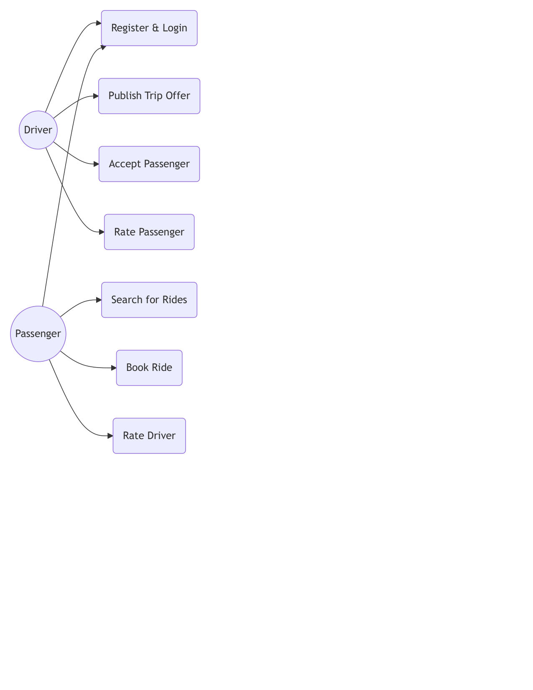

---

## 5. System Design and Architecture

### Architecture Style
RouteShare utilizes a **three-tier Layered MVC (Model-View-Controller)** architecture. The system is organised into distinct packages (Controller, Service, Repository) with dedicated sub-packages for Integration and Pricing logic, ensuring clear separation of concerns and high cohesion within each module.

### Technology Stack Justification
- **Spring Boot 3 (Java 17):** Chosen for its mature Dependency Injection container, built-in REST support, and well-documented ecosystem suitable for complex business logic.
- **MySQL & Spring Data JPA:** A relational database is well-suited given the relational nature of the domain (Users → Trips → Ride Requests → Ratings). Hibernate accelerates development through Object-Relational Mapping.
- **Vanilla JS/HTML/CSS:** Chosen to keep the frontend completely lightweight, avoiding the overhead of compiling React/Angular for a project of this specific scope.

### Architecture Diagrams

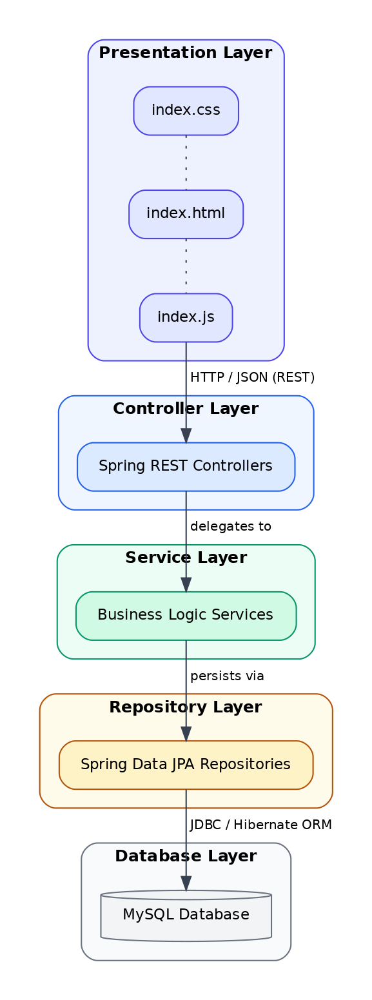

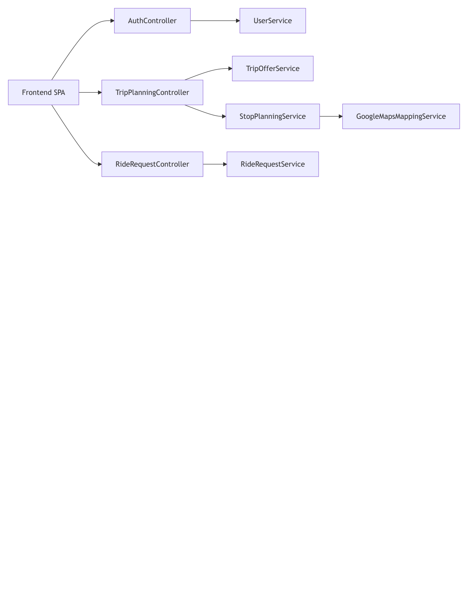

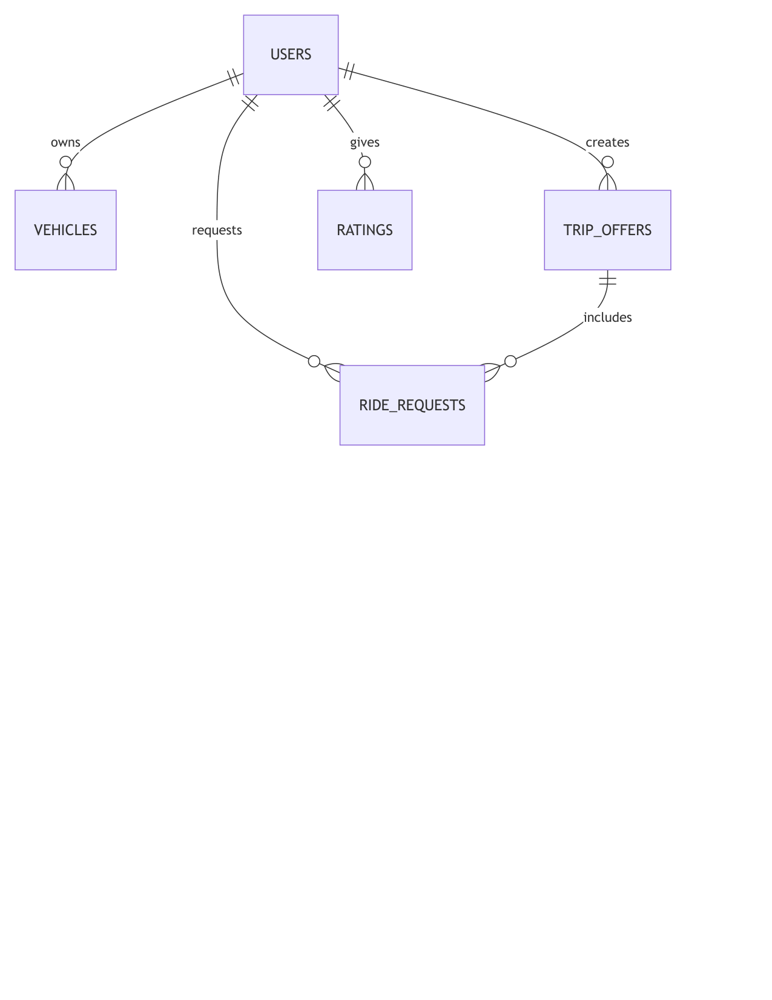

---

## 6. Implementation Details

### Core Modules
1. **Stop Planning Engine (DFS Algorithm):** The most complex module. It recursively explores all possible permutations of passenger pickups and drop-offs.
   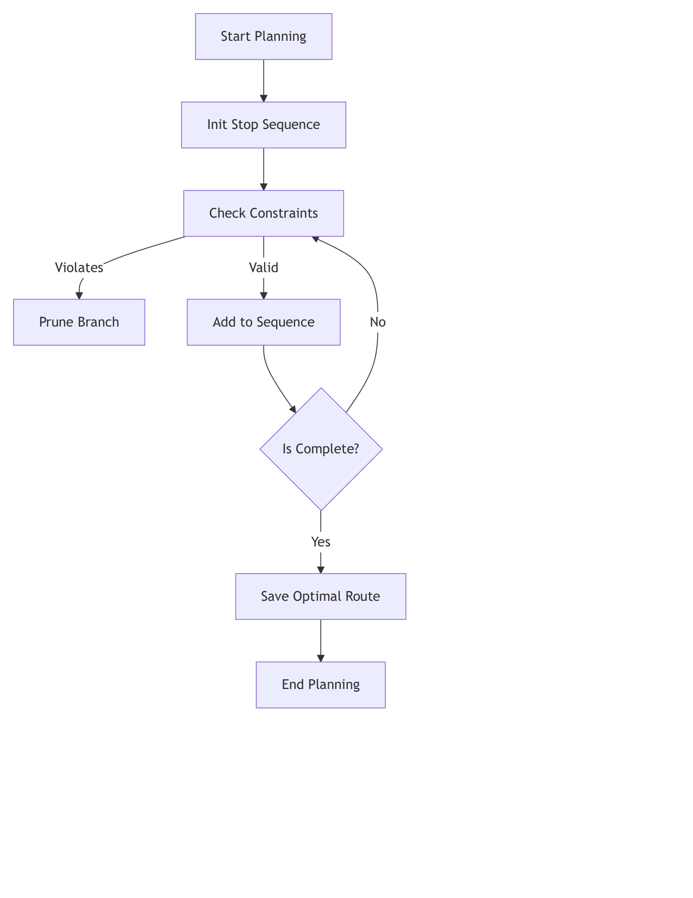

2. **Dynamic Pricing Engine:** Calculates base fares and applies chained modifiers.
   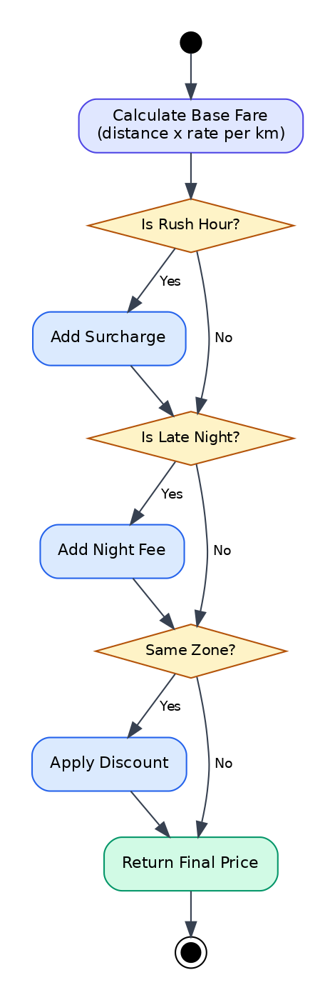

### Design Patterns
RouteShare employs 8 design patterns to maintain code quality:
1. **Strategy:** `PricingPolicy` implementations (Rush Hour, Late Night).
2. **Chain of Responsibility:** Sequential processing of pricing modifiers.
3. **Event-Driven Delegation:** Automatic reputation recalculation triggered upon new ratings via direct service invocation.
4. **Repository:** Spring Data JPA abstracting database access.
5. **DTO:** Decoupling internal entities from API responses.
6. **MVC:** Presentation, routing, and data separation.
7. **CBSE Boundary Interfaces:** Abstracting Google Maps and Stripe APIs.
8. **Dependency Injection:** Spring's IoC container managing wiring.

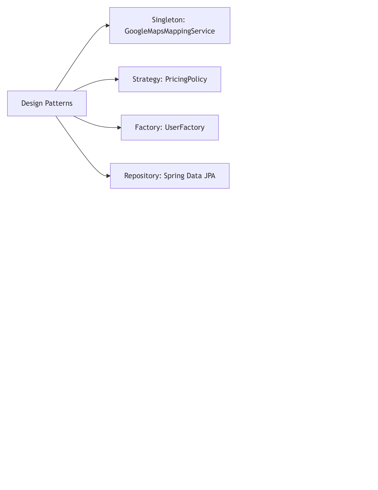

### Challenges and Solutions
- **Challenge:** The combinatorial explosion of pathfinding when a driver accepts 4+ passengers (requiring up to 8 stops).
- **Solution:** Implemented *constraint-based backtracking* in the DFS algorithm. If a partial route violates the max detour limit or vehicle capacity, that branch is pruned early. This significantly reduces the search space in practice, though worst-case complexity remains exponential.

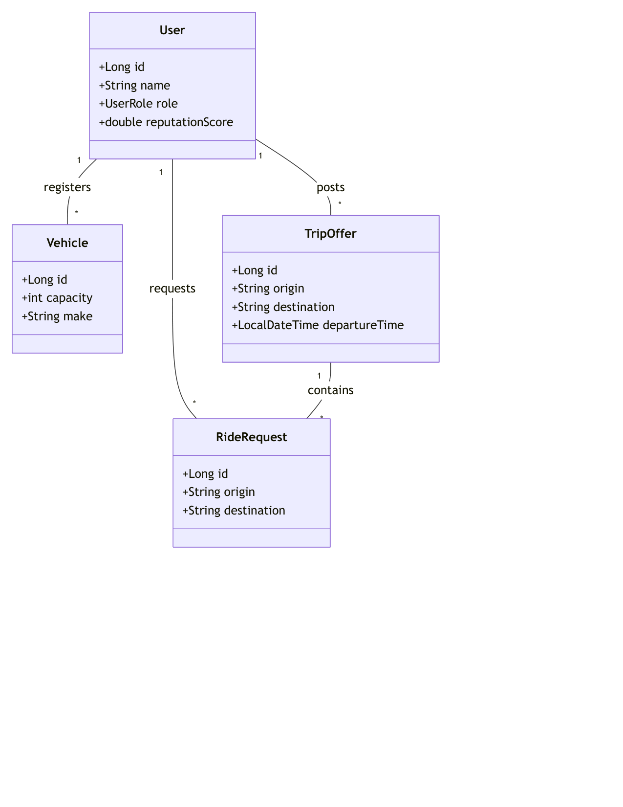

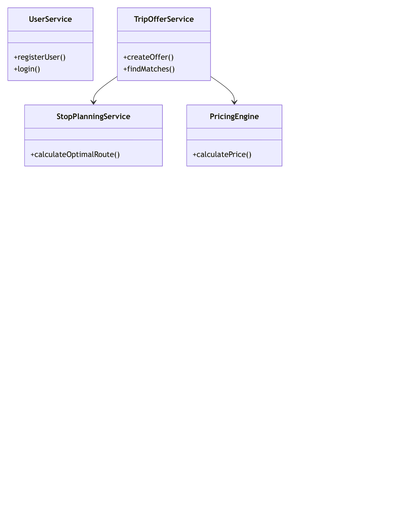

---

## 7. Testing and Quality Assurance

### Test Strategy
The application utilizes a bottom-up testing approach. **Unit tests** validate the isolated correctness of critical algorithmic engines (Pricing, Reputation, Routing) using JUnit 5. **Integration tests** ensure the Spring application context bootstraps successfully and all beans are correctly wired.

### Test Cases

| Test Focus | Input / Scenario | Expected Result | Actual Status |
|---|---|---|---|
| Pricing Engine | Weekday 8:00 AM | Apply 25% Rush Hour Surcharge | **PASS** |
| Pricing Engine | Same Zone Destination | Apply 15% Discount | **PASS** |
| Reputation Service | Score drops below 4.0 | Downgrade to STANDARD tier | **PASS** |
| Reputation Service | 45 Days Inactivity | Apply time-decay penalty | **PASS** |
| DFS Stop Planner | 2 passengers, capacity = 1 | Reject simultaneous pickups | **PASS** |
| DFS Stop Planner | Detour exceeds driver limit | Route marked `feasible = false` | **PASS** |
| Integration | Spring Context Load | All beans initialized without error | **PASS** |

### Code Coverage
Using JaCoCo automated tooling, the project achieved the following verified test coverage across 76 automated tests:
- **Service Layer (Core Algorithms & Logic):** 82% Coverage
- **Controllers:** 94% Coverage
- **Overall Application Coverage:** 84%

---

## 8. Deployment and DevOps

### Environment
The target production environment is designed for **AWS Elastic Beanstalk**, allowing the stateless Spring Boot Tomcat server to scale automatically across multiple EC2 instances. The database target is **Amazon RDS (MySQL 8.0)**. 

### CI/CD Pipeline
- **Continuous Integration:** A genuine GitHub Actions workflow (`.github/workflows/maven.yml`) is implemented to automatically run the Maven test suite and generate JaCoCo code coverage reports on every push and pull request to the `main` branch, ensuring no regressions.
- **Deployment:** The GitHub Actions pipeline can be extended to automatically package the `.jar` artifact and deploy it to the AWS environment on successful builds.

### Setup Guide (Local Execution)
1. Install Java 17+, Maven 3.8+, and XAMPP (for MySQL).
2. Start MySQL via XAMPP Control Panel.
3. Clone the repository and navigate to the project root.
4. Run: `mvn spring-boot:run`
5. Access the application at: `http://localhost:8080`

---

## 9. Project Management and Timeline

### Methodology
RouteShare was developed using an **Agile/Scrum** methodology. Development was broken into two-week sprints focusing on iterative feature delivery, allowing for continual testing of the core algorithms before building the UI.

### Work Breakdown (Sprint Timeline)
| Sprint | Focus Area | Deliverables |
|---|---|---|
| **Sprint 1** | Foundation & DB | JPA Entities, MySQL Schema, Basic CRUD |
| **Sprint 2** | Core Algorithms | DFS Stop Planner, Pricing Engine, Unit Tests |
| **Sprint 3** | Integration & Auth | Google Maps Mock, User Registration, Reputation |
| **Sprint 4** | Frontend SPA | Dashboards, API integration, Final Polish |

### Risk Assessment

| Risk | Impact | Likelihood | Mitigation Strategy |
|---|---|---|---|
| **Scope Creep** (Adding live GPS) | High | Medium | Strictly confined live tracking to version 2.0. |
| **Algorithm Performance** | High | High | Implemented constraint-based DFS pruning early in Sprint 2. |
| **Data Loss** | Severe | Low | Used Hibernate `update` strategies and transactional cascading deletes. |

---

## 10. Conclusion and Future Enhancements

### Project Status
RouteShare successfully met all its primary objectives. The backend algorithm accurately handles multi-stop route sequencing and dynamic fare calculations, and the UI successfully simulates the entire lifecycle of a commuter ride-share from registration to booking and reviewing.

### Lessons Learned
- **Technical Insight:** The DFS algorithm initially explored an impractical number of permutations. Applying strict bounding constraints (pruning) was essential to keeping response times acceptable.
- **Design Insight:** Separating pricing policies into a Chain of Responsibility pattern reduced the complexity of the core service layer and demonstrated the practical value of adhering to the Open/Closed Principle.

### Roadmap (Version 2.0)
1. **Real-time GPS Integration:** Implementing WebSockets to track driver locations on the passenger's map.
2. **Production Stripe Processing:** Replacing the `MockPaymentService` with real credit card tokenization and payout splitting.
3. **Push Notifications:** Integrating Firebase Cloud Messaging (FCM) to alert users when a ride request is matched.

---

## Appendix: Additional Interaction & Flow Diagrams

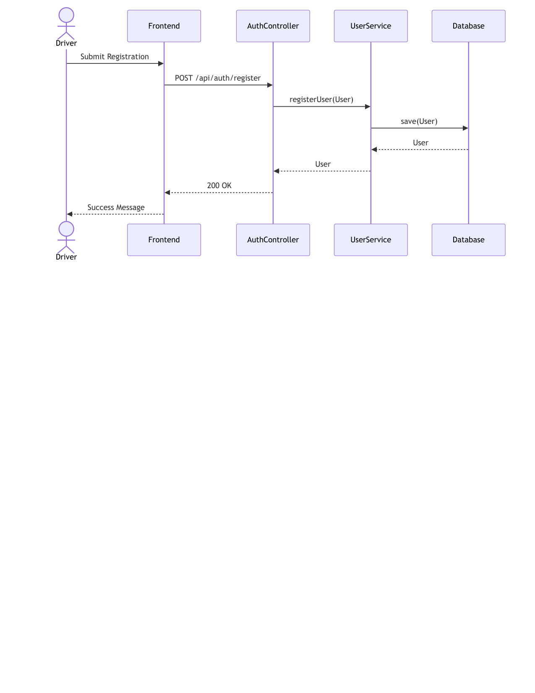

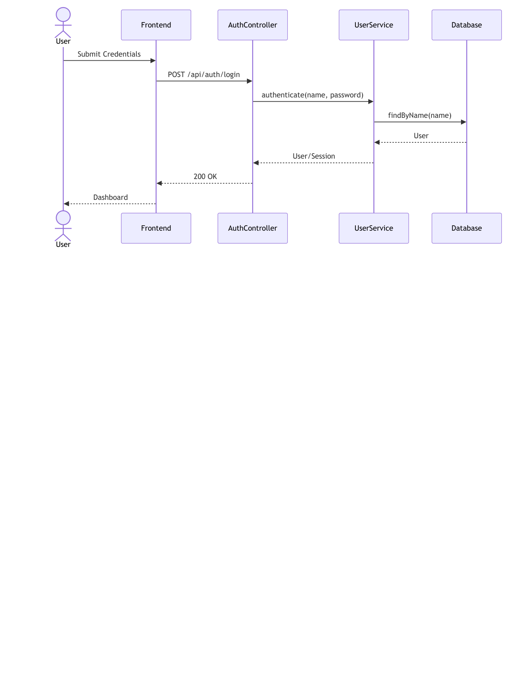

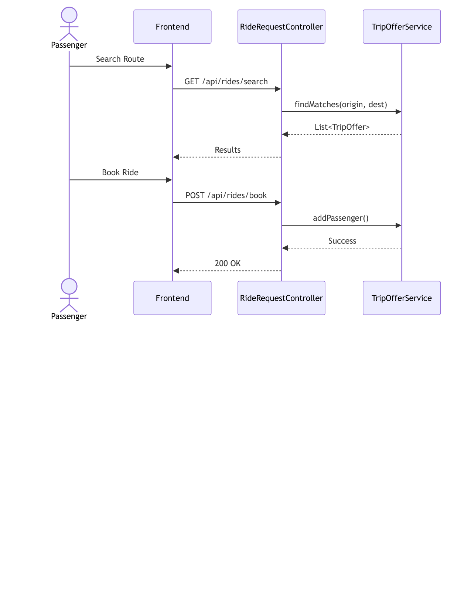

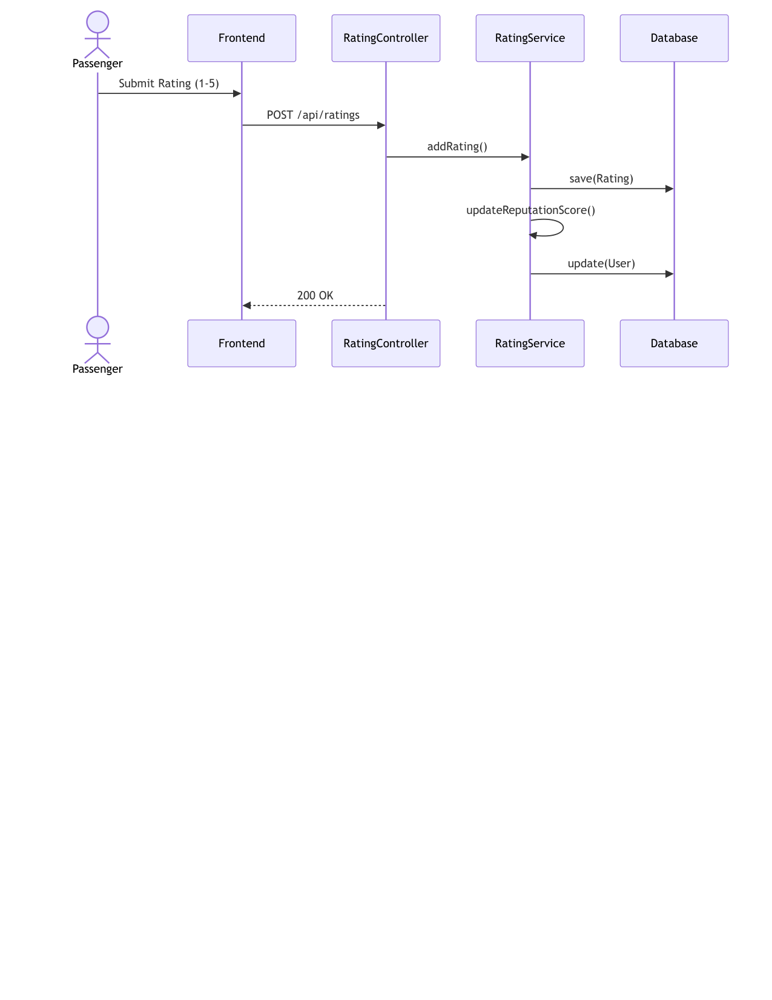

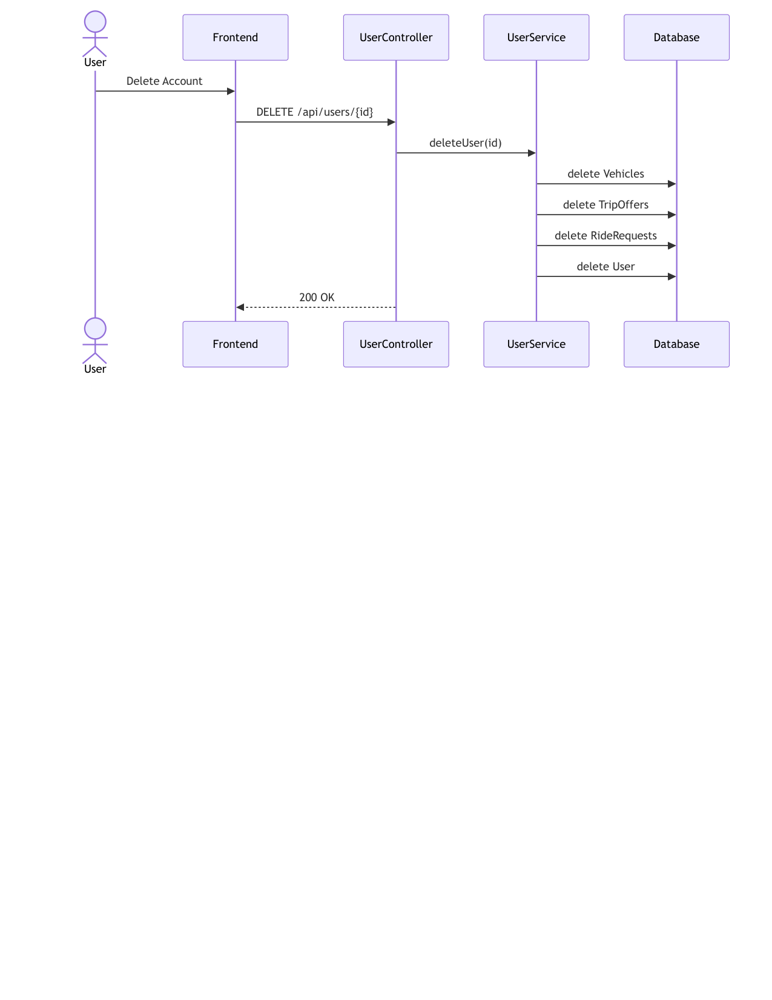

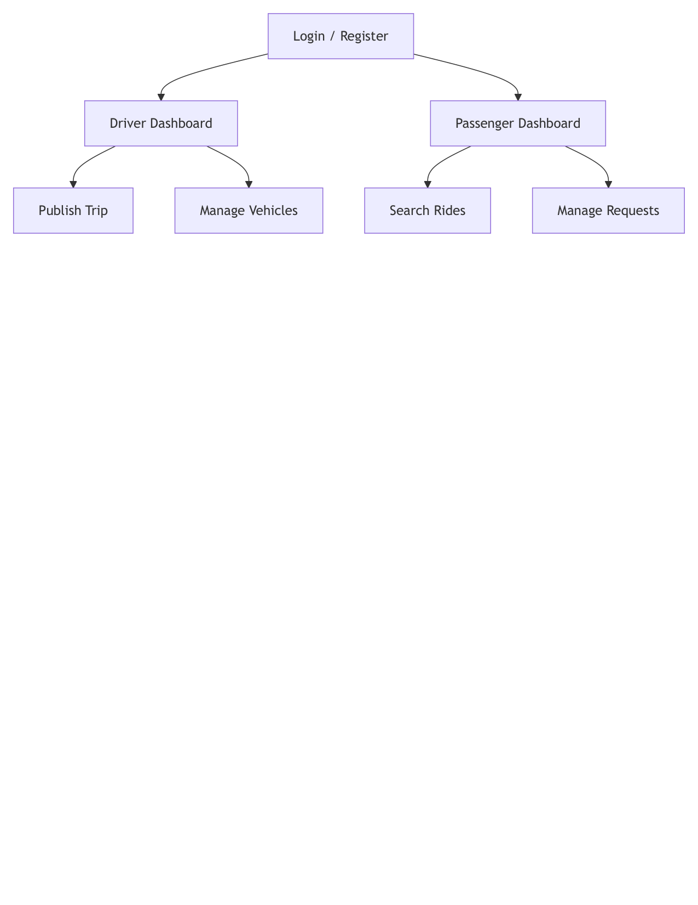
